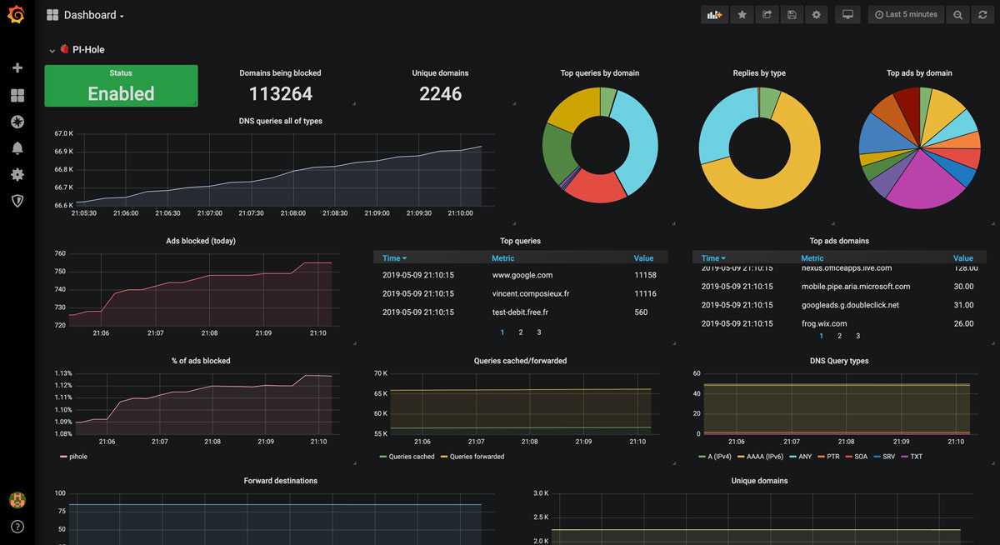

# Prometheus Metrics Exporter for Pi-hole

If you’re running Pi-hole as your network-wide ad blocker, chances are you’ve wondered how to get better visibility into its performance over time. The built-in web UI gives you a quick glance at queries and block stats, but it’s limited when you want historical trends, custom alerts, or centralized monitoring.

That’s where pihole-exporter comes in. It’s a small service that scrapes stats from your Pi-hole instance and exposes them in a format that Prometheus understands. From there, it’s easy to build Grafana dashboards, set up alerts, and monitor multiple Pi-hole instances if needed.

For more info, see the original article at: [TBD]

## Deployment

You can deploy this app template using Portainer:

1. Configure your Portainer Server to use the App Templates hosted in this repository. See [how-to instructions](../README.md#how-to-use-the-templates) for more info.
2. Look for the app template called **Pi-hole Exporter** and click on it.
3. <ins>Review the notes under **Information**</ins> and modify the **Configuration** values accordingly.
4. Click on **Deploy the stack**.